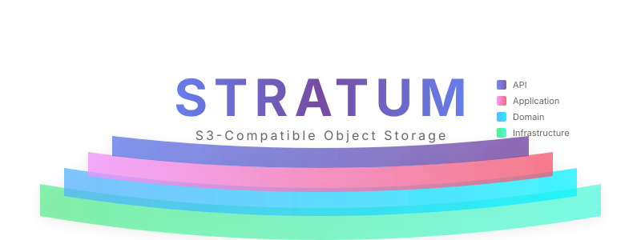

<p align="center">
  
</p>

<p align="center">
  
  
  
</p>

# Stratum

S3-compatible object storage server for local hosting. Built with .NET 10, Clean Architecture, and designed for extensibility.

## Quick Start

```bash
dotnet build
dotnet run --project src/Stratum.Api/Stratum.Api.csproj
```

Or with Docker:

```bash
docker-compose up -d
```

## Features

- Full S3 API compatibility
- Clean Architecture (DDD + CQRS)
- Plugin system for extensibility
- OpenTelemetry, Serilog, Prometheus metrics
- Filesystem storage with SQLite metadata
- Multipart upload support
- AWS Signature V4 authentication

## Project Structure

```
Stratum/
├── src/
│   ├── Stratum.Domain/          # Core domain logic
│   ├── Stratum.Application/     # CQRS handlers
│   ├── Stratum.Infrastructure/   # Storage, auth
│   ├── Stratum.Api/            # REST API
│   └── Stratum.PluginContracts/ # Plugin interfaces
├── tests/
│   ├── Stratum.UnitTests/      # Unit tests
│   └── Stratum.IntegrationTests/ # Integration tests
└── deploy/
    └── docker/                 # Docker files
```

## Configuration

Edit `appsettings.json`:

```json
{
  "Server": {
    "ListenUrl": "http://0.0.0.0:9000",
    "EnableHttp3": true
  },
  "Storage": {
    "DataDirectory": "./data"
  }
}
```

## API Endpoints

### Buckets
- `PUT /{bucket}` - Create bucket
- `DELETE /{bucket}` - Delete bucket
- `HEAD /{bucket}` - Check bucket exists
- `GET /` - List all buckets

### Objects
- `PUT /{bucket}/{key}` - Upload object
- `GET /{bucket}/{key}` - Download object
- `HEAD /{bucket}/{key}` - Get object metadata
- `DELETE /{bucket}/{key}` - Delete object
- `GET /{bucket}?list-type=2` - List objects (V2)

### Multipart Upload
- `POST /{bucket}/{key}/uploads` - Initiate multipart upload
- `PUT /{bucket}/{key}/upload` - Upload part
- `POST /{bucket}/{key}/complete` - Complete multipart upload
- `DELETE /{bucket}/{key}/abort` - Abort multipart upload

## AWS CLI Usage

```bash
aws configure --profile stratum
export AWS_ENDPOINT_URL=http://localhost:9000

aws s3 ls --endpoint-url http://localhost:9000 --profile stratum
aws s3 mb s3://my-bucket --endpoint-url http://localhost:9000 --profile stratum
aws s3 cp file.txt s3://my-bucket/file.txt --endpoint-url http://localhost:9000 --profile stratum
```

## Tech Stack

- .NET 10 / C# 13
- Kestrel with HTTP/3
- SQLite for metadata
- Filesystem for object storage
- AWS Signature V4
- Serilog + OpenTelemetry

## Development

```bash
dotnet test
```

Commit format: `feat:`, `fix:`, `docs:`, `refactor:`, `test:`

## Roadmap

- RocksDB metadata backend
- S3 gateway storage backend
- Event-driven architecture
- Plugin system implementation
- Blazor management UI
- Server-side encryption
- Object versioning
- Lifecycle policies
- Kubernetes Helm charts

## License

MIT
